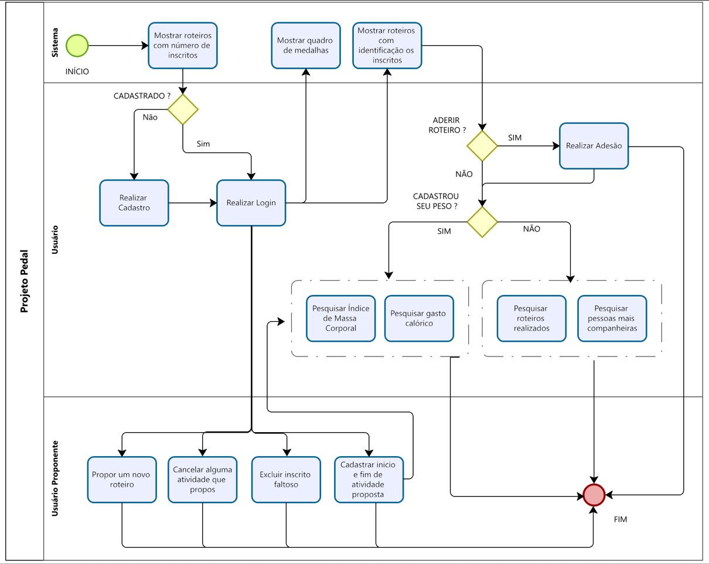

# Projeto de Interface

A seguir são apresentados o diagrama de fluxo e o wireframe elaborados para o Projeto Pedal. 

## Diagrama de Fluxo

O artefato diagrama de fluxo do Projeto Pedal foi elaborado considerando a interação entre o usuário comum, usuário proponente e o sistema. 

O fluxo de inicia com o carregamento da página do projeto, neste momento é apresentado de maneira simplificada para o usuário as opções de roteiros já cadastrados no sistema.

Após realizar o login ou cadastro inicial o usuário é direcionado para página principal onde poderá visualizar os detalhes de cada uma das opções de roteiro disponíveis, com a lista de participantes já inscritos e o quadro de medalhas que apresenta os três usuários com mais km pedalado. O usuário poderá ainda realizar sua adesão a determinado roteiro de interesse. 

A seguir o usuário poderá consultar seu histórico de participação, isto é quais roterios já participou, com quem mais pedalou e ainda obter informações sobre seu índice de massa corporal e gasto calórico em determinado roteiro realizado. 

Poderá também propor um novo roteiro, cancelar alguma atividade ou excluir participante faltoso de alguam atividade que ele próprio propos. 

Segue o diagrama de fluxo do Projeto Pedal.

As referências abaixo irão auxiliá-lo na geração do artefato “Diagramas de Fluxo”.

> **Links Úteis**:
> - [Fluxograma online: seis sites para fazer gráfico sem instalar nada | Produtividade | TechTudo](https://www.techtudo.com.br/listas/2019/03/fluxograma-online-seis-sites-para-fazer-grafico-sem-instalar-nada.ghtml)

## Wireframes

São protótipos usados em design de interface para sugerir a estrutura de um site web e seu relacionamentos entre suas páginas. Um wireframe web é uma ilustração semelhante do layout de elementos fundamentais na interface.
 
> **Links Úteis**:
> - [Protótipos vs Wireframes](https://www.nngroup.com/videos/prototypes-vs-wireframes-ux-projects/)
> - [Ferramentas de Wireframes](https://rockcontent.com/blog/wireframes/)
> - [MarvelApp](https://marvelapp.com/developers/documentation/tutorials/)
> - [Figma](https://www.figma.com/)
> - [Adobe XD](https://www.adobe.com/br/products/xd.html#scroll)
> - [Axure](https://www.axure.com/edu) (Licença Educacional)
> - [InvisionApp](https://www.invisionapp.com/) (Licença Educacional)
