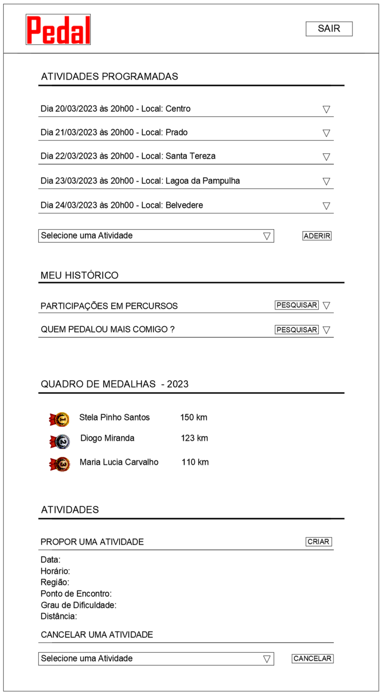

# Projeto de Interface

A seguir são apresentados o diagrama de fluxo e o wireframe elaborados para o Projeto Pedal. 

O diagrama de fluxo mostra a interação do usuário com o sistema, é concebido a partir de "boxes" que possuem a indicação dos principais elementos da interface e as conexões ou caminhos que representam os diversos fluxos possiveis dentro do sistema. 

Os wireframes são prototipos da interface do sistema, representam um esboço da estrutura do site e apresentando o relacionamento entre as páginas. 

## Diagrama de Fluxo

O artefato diagrama de fluxo do Projeto Pedal foi elaborado considerando a interação entre o usuário comum, usuário proponente e o sistema. 

O fluxo de inicia com o carregamento da página do projeto, neste momento é apresentado de maneira simplificada para o usuário as opções de roteiros já cadastrados no sistema.

Após realizar o login ou cadastro inicial o usuário é direcionado para página principal onde poderá visualizar os detalhes de cada uma das opções de roteiro disponíveis, com a lista de participantes já inscritos e o quadro de medalhas que apresenta os três usuários com mais km pedalado. O usuário poderá ainda realizar sua adesão a determinado roteiro de interesse. 

A seguir o usuário poderá consultar seu histórico de participação, isto é quais roterios já participou, com quem mais pedalou e ainda obter informações sobre seu índice de massa corporal e gasto calórico em determinado roteiro realizado. 

Poderá também propor um novo roteiro, cancelar alguma atividade ou excluir participante faltoso de alguam atividade que ele próprio propos. 

Segue o diagrama de fluxo do Projeto Pedal.

## Wireframes

